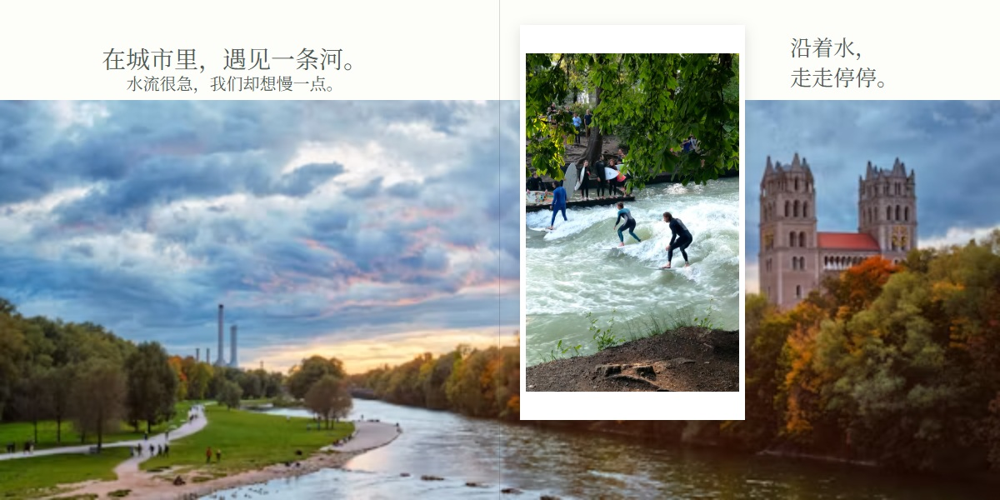
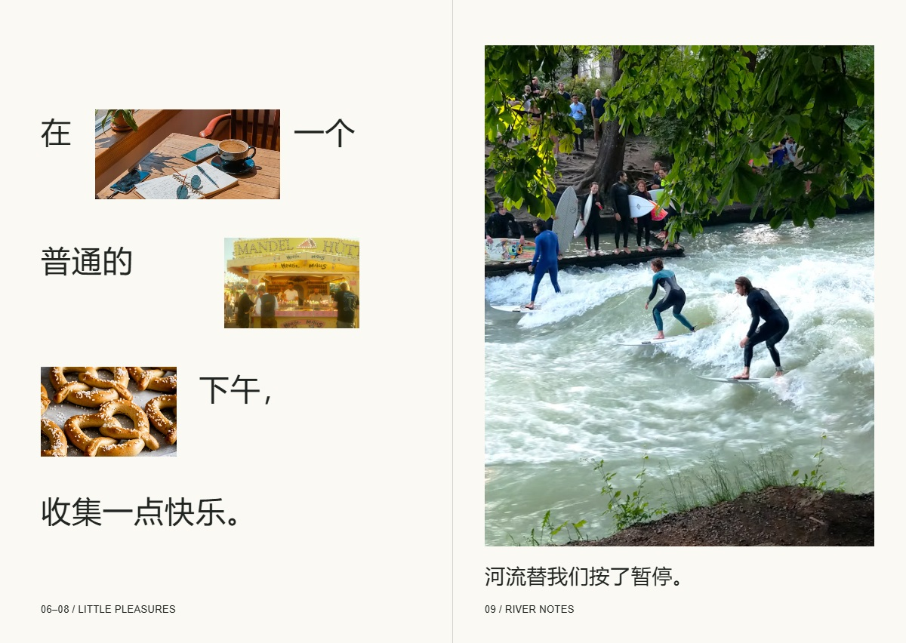
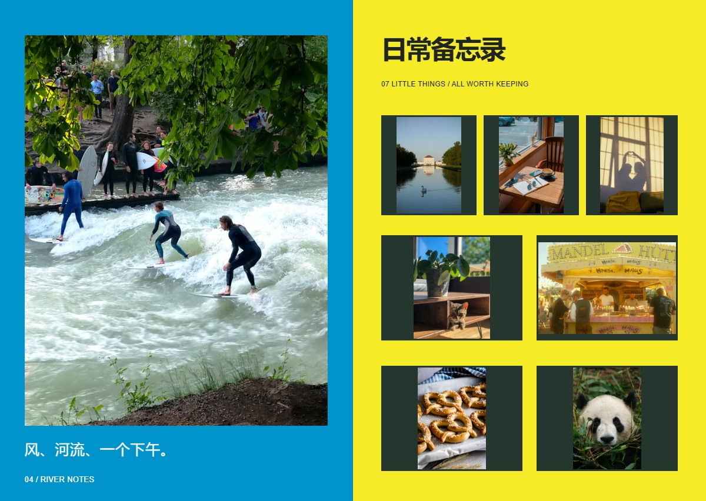
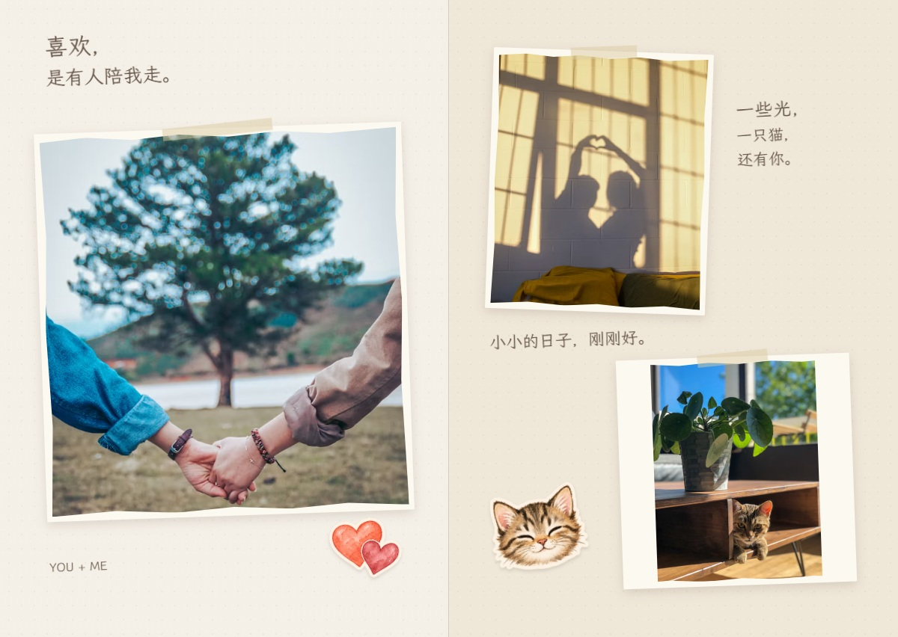
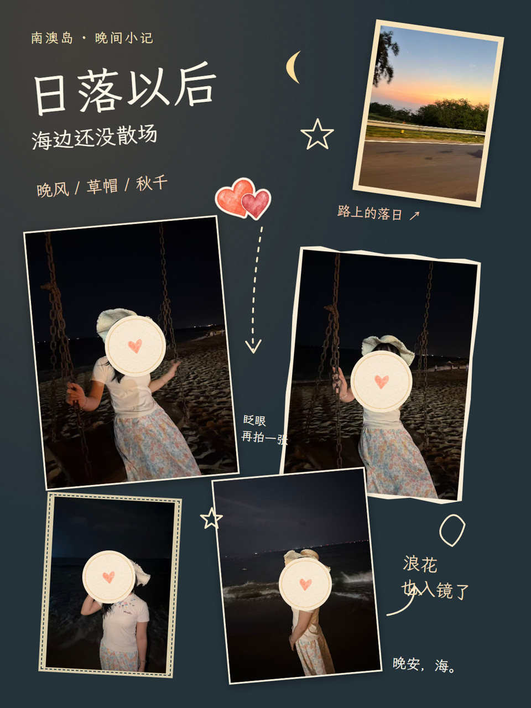
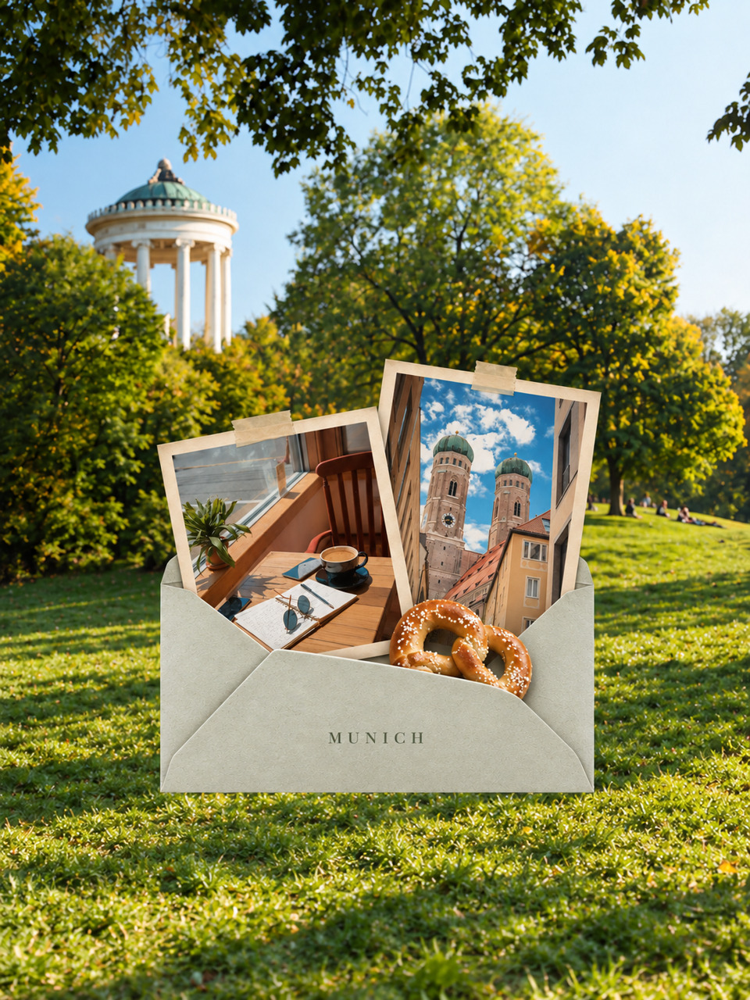
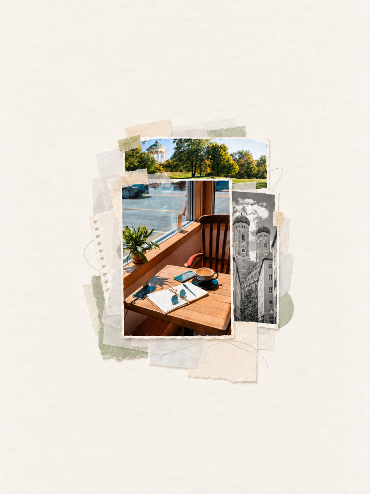

# Photo Book Studio

### 照片进来，故事成册。

作者：[weilun](https://github.com/strivekboy-coder)

AI读懂照片，把零散瞬间串成故事。结合画面里的细节与你提供的描述，整理事件、拟写文案，再根据你的照片量身设计模板与布局，配上可爱贴纸、炫酷背景和不同风格的文字。你可以继续提意见修改；内页完成后，再根据整本相册的内容用image制作专属封面。

[](https://strivekboy-coder.github.io/photo-book-studio/)

**[打开作品展示 ↗](https://strivekboy-coder.github.io/photo-book-studio/)** · **[下载 Skill](https://github.com/strivekboy-coder/photo-book-studio/releases)**

## 先翻四本小书

| 猫咪日常 | 情侣日记 | 摄影叙事 | 成都英文日记 |
|---|---|---|---|
| [今天也很会偷懒](https://strivekboy-coder.github.io/photo-book-studio/showcase/cat/) | [和你，慢慢来](https://strivekboy-coder.github.io/photo-book-studio/showcase/couple/) | [有风的日子](https://strivekboy-coder.github.io/photo-book-studio/showcase/photographic-story/) | [Slow Days in Chengdu](https://strivekboy-coder.github.io/photo-book-studio/showcase/chengdu/) |
| 6张照片，把家变软。 | 10张照片，把日常写成情书。 | 12张照片，用场景、细节与留白讲故事。 | 17张照片，英文记录慢旅行。 |


[](https://strivekboy-coder.github.io/photo-book-studio/showcase/photographic-story/?page=2)

## 同样的照片，三种 zine

同一组12张照片，用三种不同的设计语言重新编排：极简编辑式、高饱和拼贴、纸感手作。每张照片在各自书里出现一次。

| 极简编辑式 | 高饱和拼贴 | 纸感手作 |
|---|---|---|
| [拾起日常](https://strivekboy-coder.github.io/photo-book-studio/showcase/zine-editorial/) | [把日子晒出来](https://strivekboy-coder.github.io/photo-book-studio/showcase/zine-collage/) | [把日常贴起来](https://strivekboy-coder.github.io/photo-book-studio/showcase/zine-handmade/) |
|  |  |  |

告诉AI你喜欢的风格，同一组照片，也能换一种表达。这是三种示范，不是固定模板菜单。主题、视觉风格与创意处理分别决定：情侣、宠物、旅行都可以选择适合自己的设计。问卷、照片清单、故事文案、贴纸评估、七条创意路线、封面和审核流程仍正常运行。

风格与构图指引随Skill提供，不依赖作者聊天记录；额外创意Skills用于适合的资产处理，不要求每本书使用全部效果。

## 根据你的照片，量身做一本

- **AI读懂照片，把零散瞬间串成故事。** 结合人物、场景与小细节，以及你提供的回忆，整理事件、拟写标题和旁白；没写文案的地方，也能帮你起个头。
- **模板与布局量身设计。** 根据照片的方向、色彩、人物与故事，选择、改造或新建合适的版式。
- **可爱贴纸，来自照片里的小事。** 小猫、食物、交通工具和旅行元素，和回忆放在一起。
- **炫酷背景，也有留白。** 事件照片可以变成撕纸背景，风景和插画接着画下去。
- **风格由你选。** 温暖、可爱、浪漫、极简、复古或zine感，中英文都能安排。
- **继续按你的意见修改。** 放大某张照片、换文案、移动贴纸、调整裁切和页面节奏。
- **相册完成，再画封面。** 根据整本的内容、色彩与情绪，用可用的image工具制作最终封面。
- **选中的照片，都放进书里。** 保留原图，完成后能网页翻阅，也能导出印刷PDF。

## 新功能！

### Plog / 手账本模式

[](https://strivekboy-coder.github.io/photo-book-studio/showcase/plog/)

除了相册，Skill 新增了 Plog / 手账本模式。在此模式中，可以手动对图片、贴纸和文字进行简单编辑。只有你想做 Plog、手账或提供这种参考时才启用；普通相册继续按原流程制作。

制作后的 HTML 默认带微调：移动、等比缩放、旋转照片和装饰，修改文字、字号、颜色与字体。也可以只通过对话修改，再按要求交付 PNG／JPG。PDF 只在明确要求时导出。

**[看一张手账小记 ↗](https://strivekboy-coder.github.io/photo-book-studio/showcase/plog/)** · **[完整流程与首次问卷](docs/PROCESS.md)**

## 照片之外，再留一点感觉

| 给一个哈欠留白 | 把牵手变成记忆 | 让风景走出照片 | 寄给下一次出发 |
|---|---|---|---|
|  |  |  |  |
| Minimal Zine Poster | Photo Abstract Editorial | Gathered Scenes | Photo to Zine Postcard |

| 把片段装进信封 | 让树木走出画框 | 给照片一点纸的触感 |
|---|---|---|
|  |  |  |
| Travel Envelope | Subject Breaks the Frame | Three-photo Paper Collage |

七条创意路线都有适配说明；统一评估七条：极简 Zine、照片抽象记忆、Gathered Scenes、照片明信片、信封旅行拼贴、主体突破画框和三照片纸感拼贴。新增示例采用重新选图与叠合后的版本，使用时仍需对照原图检查细节；旧的未获认可试稿不用于展示。额外风格 skill 是可选增强。


新增三条可选处理：[信封旅行拼贴](https://github.com/HwawH-J-Y/travel-envelope)、主体突破画框、三照片纸感拼贴。后两条保存用户提供的原始 prompt；信封路线提供独立适配 prompt 与来源链接，无需安装额外运行程序。全部七条先评估，再按需要选择；Plog 仍遵循照片、文字与材料的构图流程。

## 推荐一起安装的创意 Skills

想做出展示里的特别页面，可以选装这些创意 Skills。制作时会根据照片内容挑选合适的路线：

| Skill | 适合做什么 |
|---|---|
| [Minimal Zine Poster](https://github.com/LiamGvchi/gc-minimal-zine-poster) | 留白、大字与小拼贴，适合封面和安静的故事页。 |
| [Photo Abstract Editorial](https://github.com/ZzzLc0405/photo-abstract-editorial) | 保留真实照片，搭配从照片提炼的抽象记忆面板。 |
| [Gathered Scenes](https://github.com/Zeejay0/gathered-scenes-zine-skill) | 用撕纸边缘连接照片与插画，也能做事件背景。 |
| [Photo to Zine Postcard](https://github.com/Whiplashzeb/photo-to-zine-postcard) | 把照片做成旅行明信片、纪念卡或小插页。 |

也可以安装统一入口 [Zine](https://github.com/jas0nh/zine-poster-skill)，集中使用其中的多种纸刊风格；展示制作中也使用了这个入口。把仓库链接交给 Codex，请它安装对应 Skill，再开启新会话即可。生成封面、贴纸和插画还需要可用的 image 工具。

这些是推荐增强，基础照片排版可以直接开始；第三方 Skills 的使用与许可以各自仓库为准。

## 真实相册，也能这样做

从作者制作的相册中，选出六个背影与风景片段展示。

[](https://strivekboy-coder.github.io/photo-book-studio/showcase/real-life/)

[](https://strivekboy-coder.github.io/photo-book-studio/showcase/real-life/?page=4)

**[翻看六个真实片段 ↗](https://strivekboy-coder.github.io/photo-book-studio/showcase/real-life/)**

## 事件页与写信页

[](https://strivekboy-coder.github.io/photo-book-studio/showcase/munich/?page=3)

[](https://strivekboy-coder.github.io/photo-book-studio/showcase/chengdu/?page=7)

## 运行能力与可选插件

基础照片排版、网页预览和本地导出**没有必装的第三方插件**。Python、Node.js、Pillow、Playwright 和浏览器等运行依赖见下方安装与导出说明；它们不是 Codex 插件。

| 能力或插件 | 是否必需 | 用途与限制 |
|---|---|---|
| 可用的 image 工具 | 仅生成插画、贴纸或生成式衍生图时需要 | 没有生成工具时仍能使用真实照片、现有素材和原生线条完成排版。 |
| Adobe | 可选 | 素材检索、抠图、照片调整与字体探索；具体工具可能需要登录，Stock 授权与费用需逐项确认。 |
| Figma | 可选 | 用户要求接入已有 Figma 文件或支持可编辑设计流程时再评估；连接本身不保证提供 Plog 的完整编辑功能。 |
| GitHub | 可选 | 发布或协作维护仓库；制作私人相册不需要连接 GitHub。 |

插件安装、账号登录和素材授权是不同的条件。开始相关操作前检查当前可用能力，不把某位作者已连接的插件写成所有用户必须安装的依赖。若特定能力不可用，说明实际限制并保留可行的普通照片排版路线。

Plog / 电子手账的构图、素材核查与审美检查见 [随 Skill 提供的说明](skills/photo-book-studio/references/plog-composition.md)。独立 Plog 使用 scripts/plog.py：保留照片身份、记录图层、检查字体缺字，并导出网页与 PNG。工具不会自动选择构图或替代审美审核。

## Plog 与电子手账

Plog／电子手账是 Photo Book Studio 的可选表达方式。 用途不明确时先问“相册还是 Plog／手账？”；选择 Plog 后跳过相册问卷。有风格、参考图、文字或贴纸可以一起发，没有偏好也能直接让 AI 根据照片设计。只有你提到 Plog、手账或明确提供这种风格参考时才启用；普通相册继续走现有相册流程。也可以把上传照片制作成竖版 Plog：疏密、配色、照片形状、手写文字和材料关系由照片与参考决定，密集页面也是有效选择。

安装 Skill 后，对 Codex 说：

> 使用 $photo-book-studio，为这些照片做一张 Plog。先看照片与灵感库，选择适合的手写字体和材料，保留选中的照片，导出后检查画面。

Plog 使用 Skill 内的 requirements-plog.txt 和 scripts/plog.py；[执行与图层说明](skills/photo-book-studio/references/plog-schema.md)提供完整入口。支持独立工作目录、照片清单、原图哈希、图层数据、字体缺字检查、指定页渲染，以及原尺寸/手机预览。基础材料为12个小型原生 SVG，较大素材和手写字体按项目取用与缓存。

[灵感与素材库](skills/photo-book-studio/references/plog-library.md)记录来源和实测状态。大素材包可单独发布为 GitHub Release 附件或静态网站文件，由索引按需指向；原生 SVG 与提供者索引随 Skill 提供，较大材料按项目获取和缓存。Tatter & Tag 的邮件许可按维护者转述记录，原始素材二次托管仍需明确授权。

Plog 网页默认带可选的浏览器微调：移动、等比缩放、旋转照片与装饰，修改文字，撤销与保存草稿。最终分享文件由 Codex 导出 PNG／JPG，也可汇成阅读 PDF；JSON／HTML 是继续编辑的备份。普通相册尚未加入这套自由图层编辑器。[打开 Plog 展示 ↗](https://strivekboy-coder.github.io/photo-book-studio/showcase/plog/)。Plog 展示使用一张已获同意的第一版夜间页，四处人脸已用贴纸遮挡；不发布原始照片或其他私人页面。

当前已完成逐张试稿、浏览器操作检查与独立安装验证；不承诺不同模型对任何照片都做出相同构图或质量。私人试稿与照片不包含在 Skill 包中。

## 开始做你的一本

需要 **Python 3.10+、Node.js 20.11+**。基础预览只需要 Pillow，不要求额外创意 skill。

```sh
git clone https://github.com/strivekboy-coder/photo-book-studio.git
cd photo-book-studio
python -m pip install -r requirements.txt
python scripts/install_skill.py --destination /your/codex/skills
```

Windows 可把 destination 换成自己的 Codex skills 目录。也可手动把 `skills/photo-book-studio` **整个文件夹**复制过去；其中包含模板、字体和工具，不要只复制 SKILL.md。重新打开会话使新 skill 被发现。

对 Codex 说：

> 使用 $photo-book-studio，我想给家人做一本相册。先问我必要的问题，问卷之后我再提供照片和故事。

制作时所有资料放在你自己的工作项目里，原照片保持只读。首次先做有代表性的小样；后续按批追加，不重跑整本流程。

## 命令行工具

这些命令提供可靠的初始化、清单、渲染与导出。**它们不会自动读懂照片、写故事或替代模型的审美审核。**

```sh
python skills/photo-book-studio/scripts/studio.py init /your/book --title "我们的故事"
# 填好问卷并保存 /your/book/project/brief.json，令 intakeComplete 为 true，再导入：
python skills/photo-book-studio/scripts/studio.py inventory --workspace /your/book --photos /your/selected-photos
# 模型根据联系表和描述填写 project/book.json 后：
node /your/book/scripts/build.mjs
python skills/photo-book-studio/scripts/studio.py web --workspace /your/book
```

浏览器打开项目的 `sample.html`。网页发布文件夹位于 `output/web-publish`；服务器上线是单独的操作，打包不等于已经上线。默认不附带登录或音乐，也不把前端生日谜题当访问保护。

## 印刷 PDF

```sh
python -m pip install -r requirements-print.txt
python -m playwright install chromium
python /your/book/scripts/export_pdf.py --workspace /your/book
```

已安装 Edge/Chrome 时也可用 `--browser /path/to/browser`，无需另下载 Chromium。

- 输出 `reading.pdf`、`interior.pdf`、`cover.pdf` 和 `preflight.json`。
- 页数与尺寸读取当前书稿，不固定到某一本书；四周按配置补出血。
- 默认单页正文前补一面，让原来的左/右跨页分别落在左/右位置；尾部按印厂页数倍数补齐，填字和底色可配置。
- 采用固定布局的光栅导出以保持浏览器排版；300dpi 导出不会增加原图细节，文字不保持可搜索状态。
- 内页出血不等于硬壳封面包边。封面、书脊、沟槽仍按印厂模板适配后确认。
- 默认方形 210×210mm。横/竖尺寸可以配置，但每种新比例都须重新视觉审核，不能沿用旧坐标直接宣称适合印刷。

详见 [使用与印刷说明](docs/USAGE.md)。


## 准备照片的小Tips

- **iPhone传到Windows或Linux：** 两边安装[LocalSend](https://localsend.org/download)，连接同一局域网（通常同一Wi-Fi）即可传文件。互相找不到时，检查本地网络权限与防火墙。请使用官方网站下载。
- **尽量传照片文件。** 避免先截图或通过聊天软件压缩；保留一份独立原图。HEIC/HEIF需要时转换为JPEG/PNG，原文件仍留着。
- **先做小样。** 用30–50张有代表性的照片试风格，满意后再追加。特别重要、不能裁切的照片提前标记。
- **修改说清楚位置。** 用当前网页页码＋左／右＋具体要求，一次列出相关修改。
- **想写长一点的话：** 首页或尾页增加专门写字页，适合情书、开篇、结语和旅行感想；skill会建议用image制作相关背景，并给文字留出空间。
- **计划印刷：** 先向印厂确认成品尺寸、出血和封面／书脊模板，再导最终PDF。

## 制作过程

第一次用简短问卷确定故事与偏好 → 看照片、做小样 → 分批补完整本 → 渲染检查 → 画最终封面 → 导出。

问卷只做一次；后续改文案、挪贴纸、调裁切只处理相关页。原照片保持只读，照片身份与次数由构建检查。

[详细使用与印刷说明](docs/USAGE.md) · [测试记录](docs/QA.md)

## 示例与许可

四本主题示例为效果展示，非真实用户故事；人物／动物关系、日期和文案为策展设定。摄影素材来自 Unsplash（含授权素材）及用户提供的授权图库，AI封面、插画和贴纸由image生成。图片与相册成品不属于代码的MIT许可范围，未经许可请勿转载。另有作者真实相册的六个匿名选页。详细许可信息由维护者补充，见[素材说明](examples/README.md)。

项目自有代码与流程采用 [MIT](LICENSE)，字体保留 [SIL OFL](NOTICE.md)。基础功能无需额外创意 skill；印刷封面仍需按印厂包边／沟槽模板确认。

## 首次使用署名

前三次实际调用Skill时，会在对话中简短显示作者名字与项目链接。本机用户计数跨项目和升级保留；不写入相册、不添加水印、不自动打开网页或点赞。用户可明确要求停止。计数仅保存在本机，不上传使用数据；可用 PHOTO_BOOK_STUDIO_STATE_DIR 指定位置。


Plog 页数先按照片主次、故事关系、文案量和手机辨识度决定，详见 [规划标准](skills/photo-book-studio/references/plog-planning.md)。v0.7.3 新增交付检查 `plog.py check`，完整安装包为 [photo-book-studio-v0.7.3.zip](https://github.com/strivekboy-coder/photo-book-studio/releases/download/v0.7.3/photo-book-studio-v0.7.3.zip)，包含默认微调编辑器。
