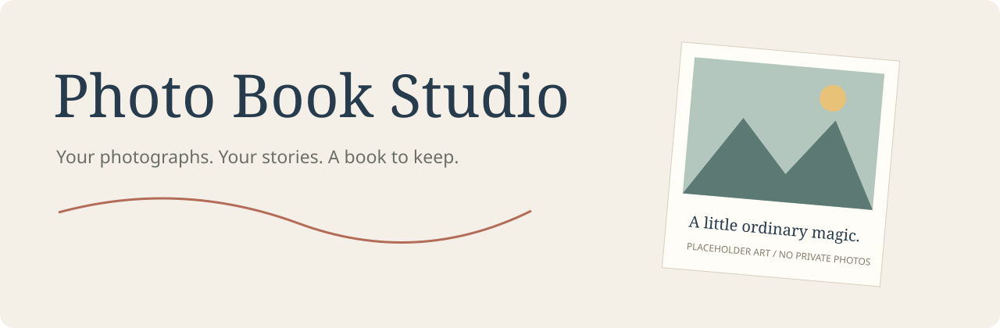
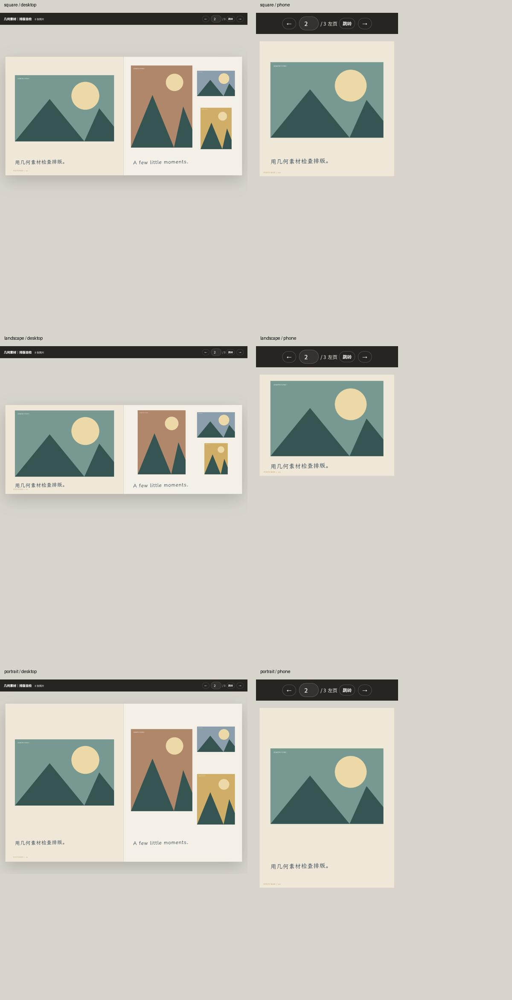

# Photo Book Studio

**把选好的照片，做成一本有故事的相册。**

用于 Codex 的照片书制作 skill：先了解你的需求，再读照片、组织故事、排版和审核。支持浏览器翻阅、手机单页阅读、静态网页打包，以及带出血的印刷 PDF。



> 当前是经过单一真实项目打磨的初始开源版本。狗狗、成长记录和情侣三组真实公开案例尚待验证；仓库内的几何素材只用于功能自检，不代表摄影案例或最终审美效果。

## 它做什么

- 保留你选中的每张照片；不因相似、画质弱或难排版而偷偷淘汰。
- 首次问卷只做一次，答案保存在 `project/brief.json`，后续修改不重复问。
- 按事件组织故事：重要照片舒展，日常碎片适度集中。
- 可爱、温暖、克制、手账或 zine 等方向；用真实照片决定排版，不机械轮换模板。
- 文案来自你的描述，或基于可见内容的少量草稿，不编造私人经历。
- **默认完成内页后，再用可用的 image 工具制作最终封面**，让封面反映整本故事。小样阶段先用占位封面；你选择照片或纯文字封面时遵循你的选择。
- 裁切、调色、贴纸、撕纸与艺术衍生图分开征求偏好，不捆绑授权。
- 校验照片身份与次数、素材存在性、页数、尺寸、旋转和出血；最后仍需看实际渲染。

## 快速开始

需要 **Python 3.10+、Node.js 20.11+**。基础预览只需要 Pillow，不要求额外创意 skill。

```sh
git clone https://github.com/strivekboy-coder/photo-book-studio.git
cd photo-book-studio
python -m pip install -r requirements.txt
python scripts/install_skill.py --destination /your/codex/skills
```

Windows 可把 destination 换成自己的 Codex skills 目录。也可手动把 `skills/photo-book-studio` **整个文件夹**复制过去；其中包含模板、字体和工具，不要只复制 SKILL.md。重新打开会话使新 skill 被发现。

对 Codex 说：

> 使用 $photo-book-studio，我想给家人做一本相册。先问我必要的问题，问卷之后我再提供照片和故事。

制作时所有资料放在你自己的工作项目里，原照片保持只读。首次先做有代表性的小样；后续按批追加，不重跑整本流程。

## 命令行工具

这些命令提供可靠的初始化、清单、渲染与导出。**它们不会自动读懂照片、写故事或替代模型的审美审核。**

```sh
python skills/photo-book-studio/scripts/studio.py init /your/book --title "我们的故事"
# 填好问卷并保存 /your/book/project/brief.json，令 intakeComplete 为 true，再导入：
python skills/photo-book-studio/scripts/studio.py inventory --workspace /your/book --photos /your/selected-photos
# 模型根据联系表和描述填写 project/book.json 后：
node /your/book/scripts/build.mjs
python skills/photo-book-studio/scripts/studio.py web --workspace /your/book
```

浏览器打开项目的 `sample.html`。网页发布文件夹位于 `output/web-publish`；服务器上线是单独的操作，打包不等于已经上线。默认不附带登录或音乐，也不把前端生日谜题当访问保护。

## 印刷 PDF

```sh
python -m pip install -r requirements-print.txt
python -m playwright install chromium
python /your/book/scripts/export_pdf.py --workspace /your/book
```

已安装 Edge/Chrome 时也可用 `--browser /path/to/browser`，无需另下载 Chromium。

- 输出 `reading.pdf`、`interior.pdf`、`cover.pdf` 和 `preflight.json`。
- 页数与尺寸读取当前书稿，不固定到某一本书；四周按配置补出血。
- 默认单页正文前补一面，让原来的左/右跨页分别落在左/右位置；尾部按印厂页数倍数补齐，填字和底色可配置。
- 采用固定布局的光栅导出以保持浏览器排版；300dpi 导出不会增加原图细节，文字不保持可搜索状态。
- 内页出血不等于硬壳封面包边。封面、书脊、沟槽仍按印厂模板适配后确认。
- 默认方形 210×210mm。横/竖尺寸可以配置，但每种新比例都须重新视觉审核，不能沿用旧坐标直接宣称适合印刷。

详见 [使用与印刷说明](docs/USAGE.md)。

## 可选增强

无需安装其他创意 skill 也能完成基础相册。有图像生成能力时才制作贴纸、撕纸或定制插画；额外的 zine 风格 skill 是可选资产工具，不接管本项目的问卷、保留照片和验收规则。缺少能力时保留照片/文字布局并说明限制，不阻塞基本交付。

## 示例与测试

下面是几何素材的桌面/手机功能自检，不是真实照片案例：




- [示例准备指南](examples/README.md)：照片、使用许可、文字和反馈如何提供。
- `python -m unittest discover -s tests -v`：验证全新安装、输入保护、重复/遗漏、素材检查和尺寸配置。
- `python tests/make_demo.py --workspace /your/demo`：生成非摄影性质的几何测试书。

真实照片示例不会复用作者私人相册。公开可见不等于可随仓库分发；示例须记录授权和来源。

## 许可与致谢

项目自有代码与流程采用 [MIT License](LICENSE)。字体分别保留 SIL OFL 许可；第三方软件和用户照片遵循各自许可，见 [NOTICE](NOTICE.md)。未打包其他作者的创意 skill，也不要求为使用本项目点赞、star 或关注。
