# Photo Book Studio

### 照片进来，故事成册。

根据你的照片量身设计模板与布局，配上可爱贴纸、炫酷背景和不同风格的文字。你可以继续提意见修改；内页完成后，再根据整本相册的内容用image制作专属封面。

[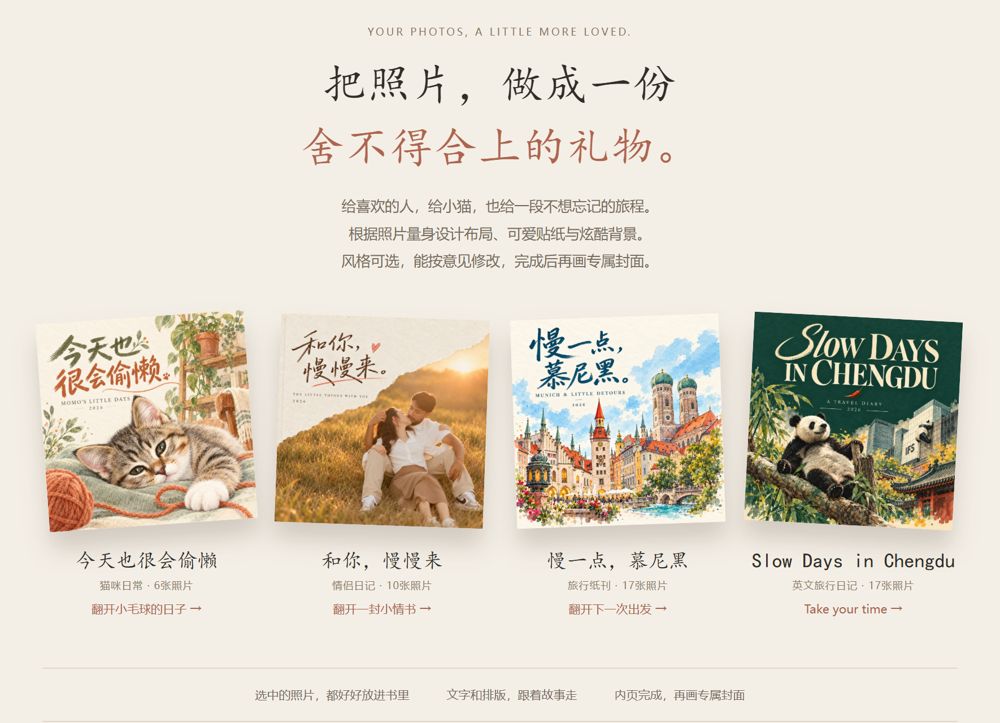](https://strivekboy-coder.github.io/photo-book-studio/)

**[打开作品展示 ↗](https://strivekboy-coder.github.io/photo-book-studio/)** · **[下载 Skill](https://github.com/strivekboy-coder/photo-book-studio/releases)**

## 先翻四本小书

| 猫咪日常 | 情侣日记 | 慕尼黑纸刊 | 成都英文日记 |
|---|---|---|---|
| [今天也很会偷懒](https://strivekboy-coder.github.io/photo-book-studio/showcase/cat/) | [和你，慢慢来](https://strivekboy-coder.github.io/photo-book-studio/showcase/couple/) | [慢一点，慕尼黑](https://strivekboy-coder.github.io/photo-book-studio/showcase/munich/) | [Slow Days in Chengdu](https://strivekboy-coder.github.io/photo-book-studio/showcase/chengdu/) |
| 6张照片，把家变软。 | 10张照片，把日常写成情书。 | 17张照片，把风景装进口袋。 | 17张照片，英文记录慢旅行。 |

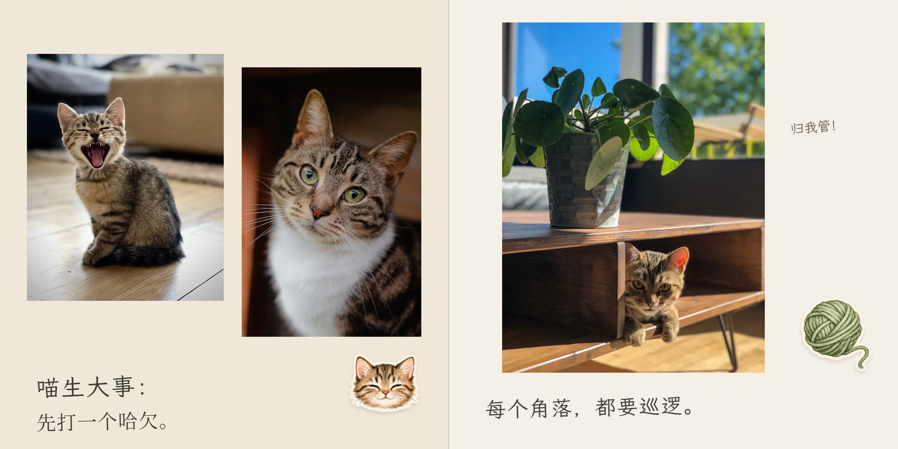

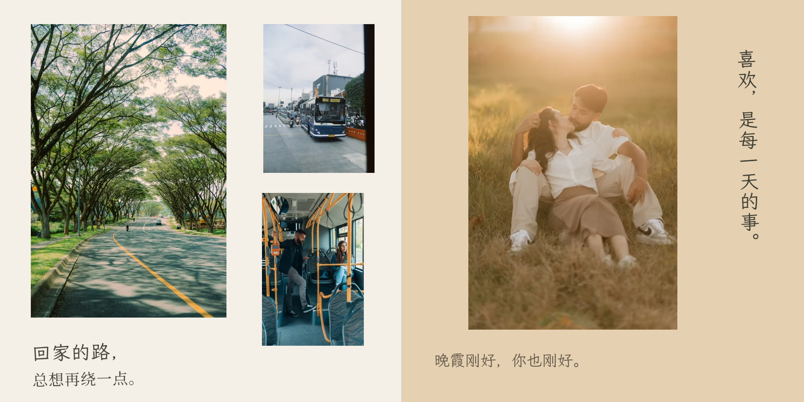

## 根据你的照片，量身做一本

- **模板与布局量身设计。** 根据照片的方向、色彩、人物与故事，选择、改造或新建合适的版式。
- **可爱贴纸，来自照片里的小事。** 小猫、食物、交通工具和旅行元素，和回忆放在一起。
- **炫酷背景，也有留白。** 事件照片可以变成撕纸背景，风景和插画接着画下去。
- **风格由你选。** 温暖、可爱、浪漫、极简、复古或zine感，中英文都能安排。
- **继续按你的意见修改。** 放大某张照片、换文案、移动贴纸、调整裁切和页面节奏。
- **相册完成，再画封面。** 根据整本的内容、色彩与情绪，用可用的image工具制作最终封面。
- **选中的照片，都放进书里。** 保留原图，完成后能网页翻阅，也能导出印刷PDF。

## 照片之外，再留一点感觉

| 给一个哈欠留白 | 把牵手变成记忆 | 让风景走出照片 | 寄给下一次出发 |
|---|---|---|---|
| 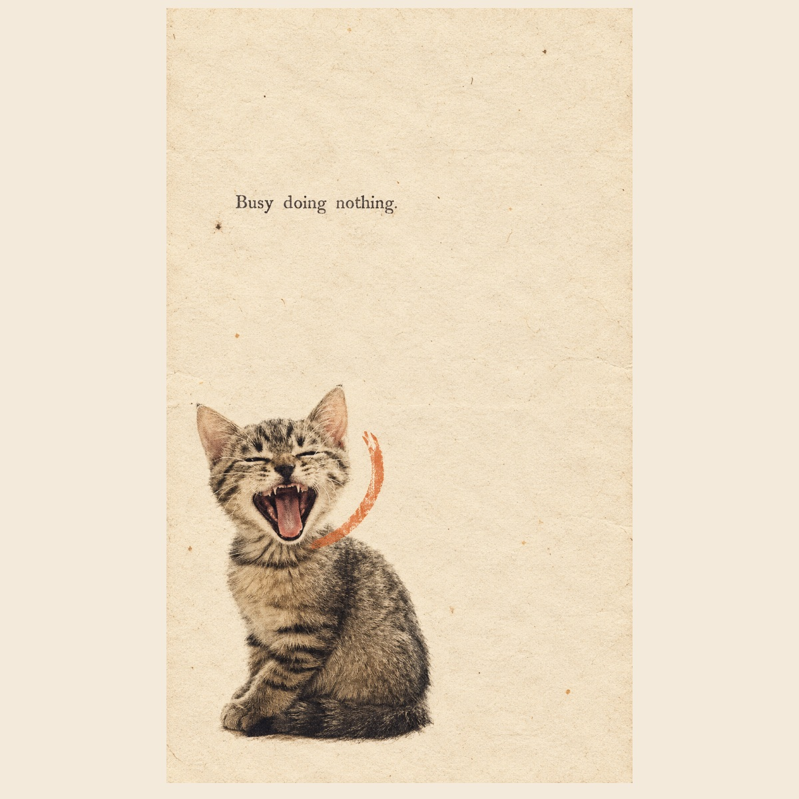 | 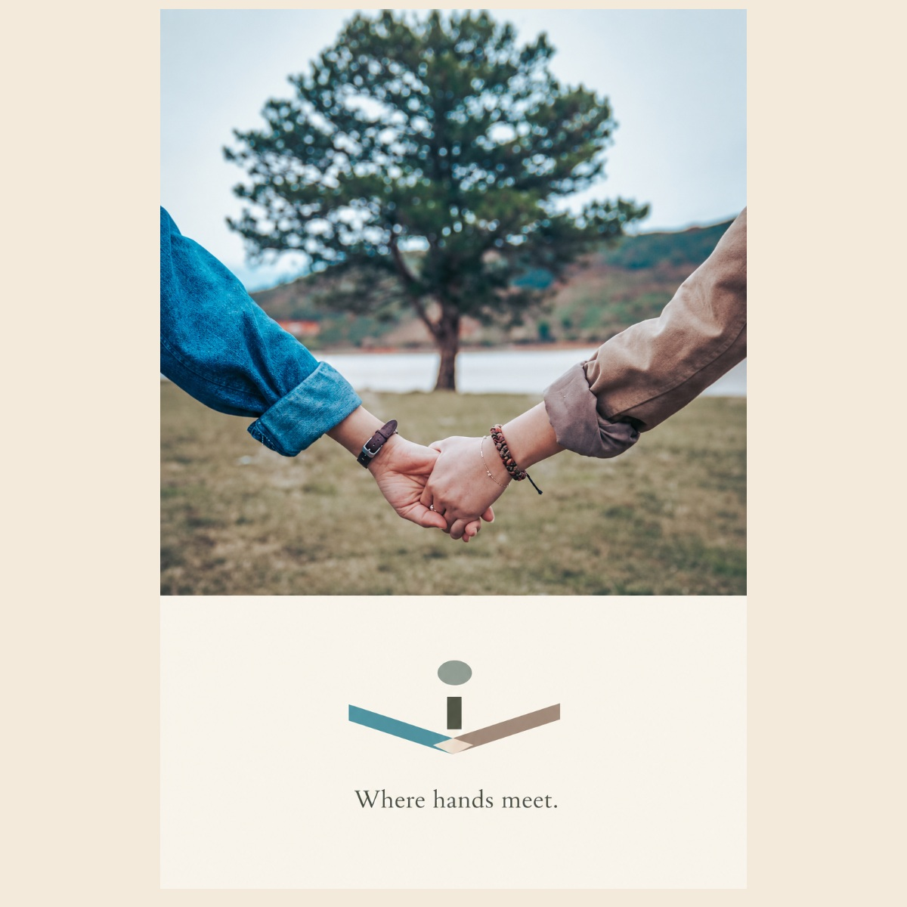 | 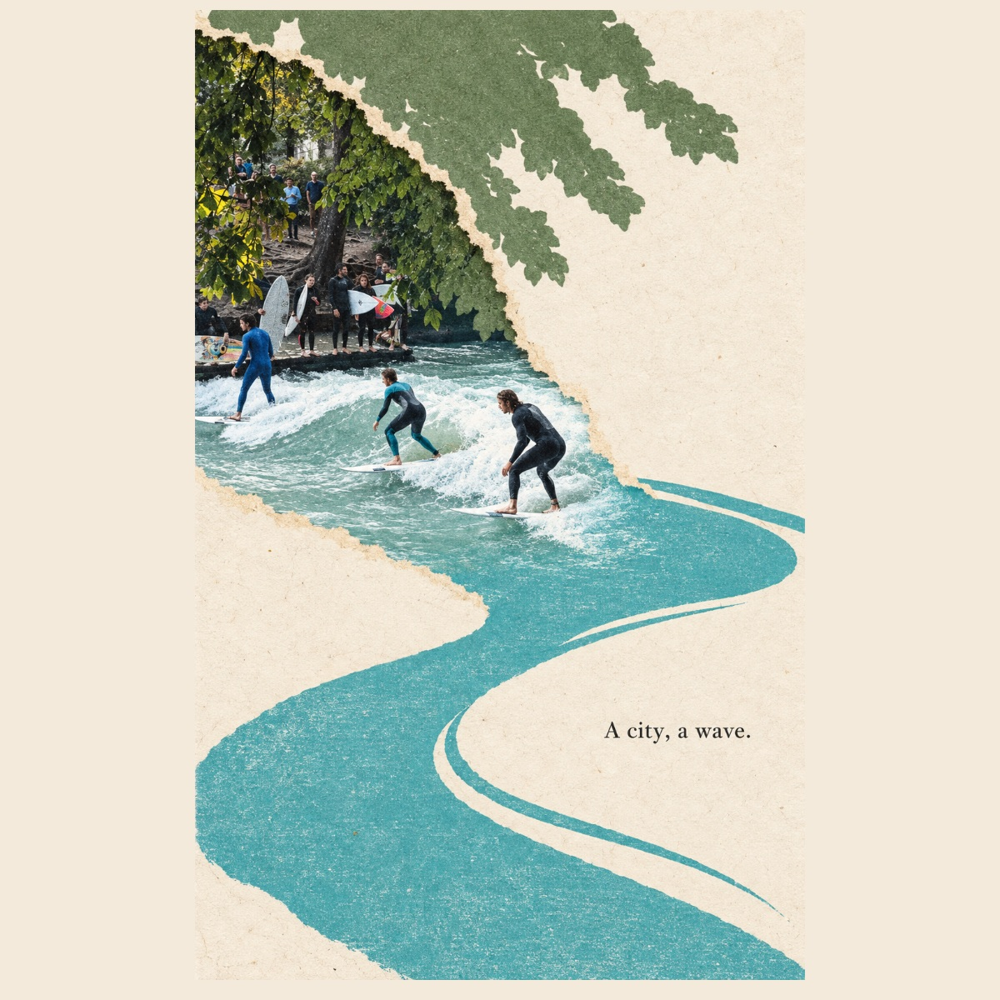 | 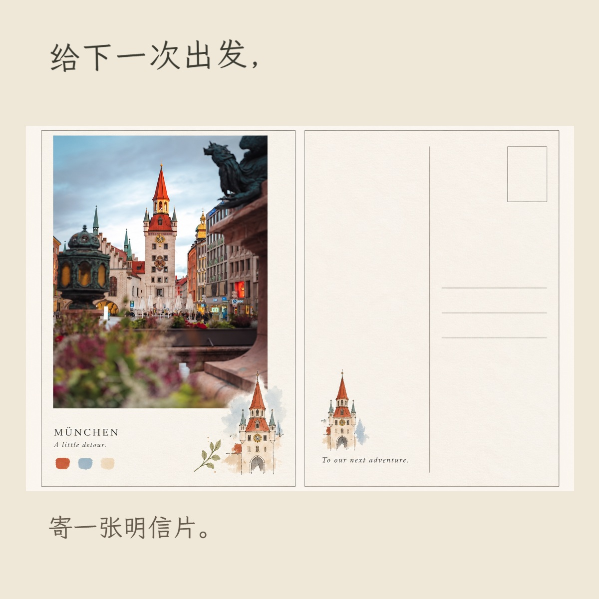 |
| Minimal Zine Poster | Photo Abstract Editorial | Gathered Scenes | Photo to Zine Postcard |

四种创意路线都已经用在示例里。它们按照片和故事选择，额外风格 skill 是可选增强。

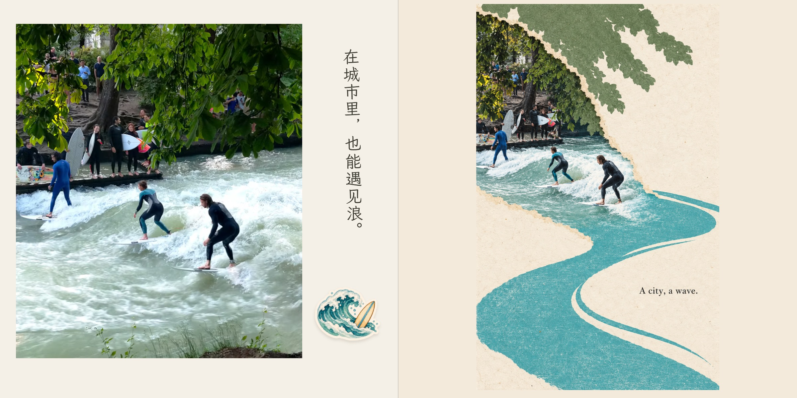

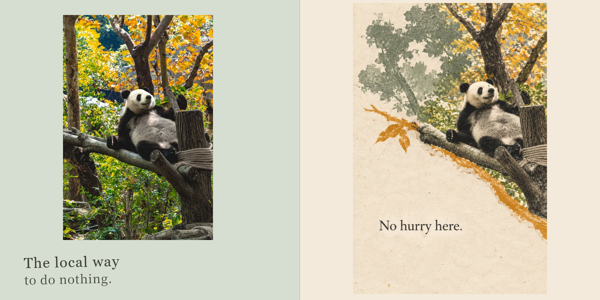

## 真实相册，也能这样做

从作者制作的相册中，只选六个背影与风景片段展示：原第7、14、15、55、58、68跨页。

[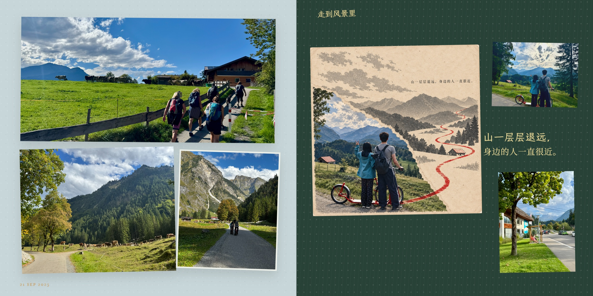](https://strivekboy-coder.github.io/photo-book-studio/showcase/real-life/)

[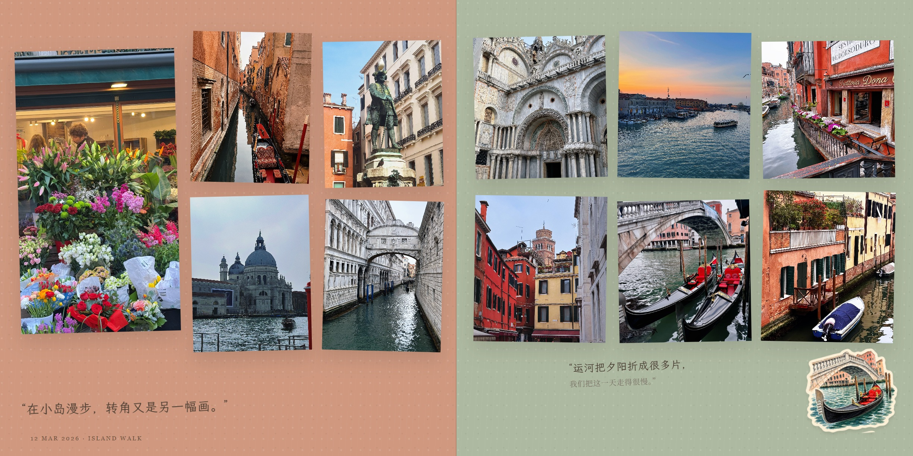](https://strivekboy-coder.github.io/photo-book-studio/showcase/real-life/?page=4)

**[翻看六个真实片段 ↗](https://strivekboy-coder.github.io/photo-book-studio/showcase/real-life/)**

## 事件页与写信页

[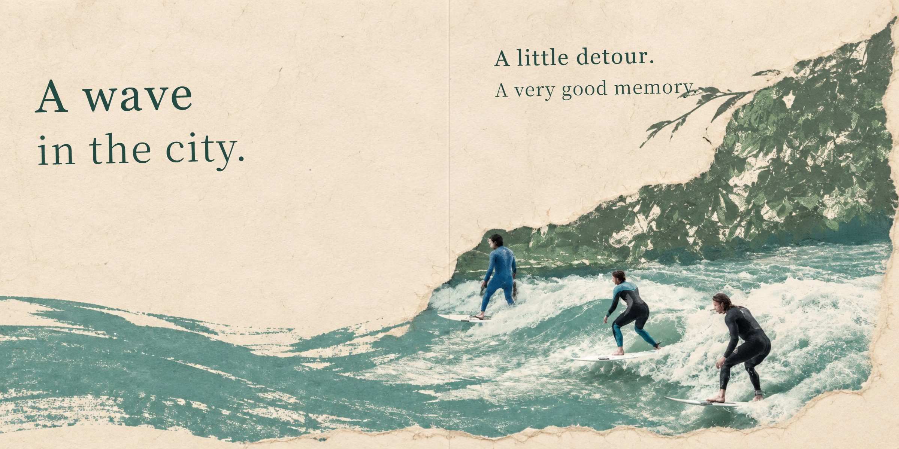](https://strivekboy-coder.github.io/photo-book-studio/showcase/munich/?page=3)

[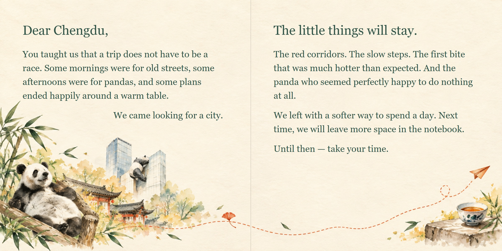](https://strivekboy-coder.github.io/photo-book-studio/showcase/chengdu/?page=7)

## 开始做你的一本

需要 **Python 3.10+、Node.js 20.11+**。基础预览只需要 Pillow，不要求额外创意 skill。

```sh
git clone https://github.com/strivekboy-coder/photo-book-studio.git
cd photo-book-studio
python -m pip install -r requirements.txt
python scripts/install_skill.py --destination /your/codex/skills
```

Windows 可把 destination 换成自己的 Codex skills 目录。也可手动把 `skills/photo-book-studio` **整个文件夹**复制过去；其中包含模板、字体和工具，不要只复制 SKILL.md。重新打开会话使新 skill 被发现。

对 Codex 说：

> 使用 $photo-book-studio，我想给家人做一本相册。先问我必要的问题，问卷之后我再提供照片和故事。

制作时所有资料放在你自己的工作项目里，原照片保持只读。首次先做有代表性的小样；后续按批追加，不重跑整本流程。

## 命令行工具

这些命令提供可靠的初始化、清单、渲染与导出。**它们不会自动读懂照片、写故事或替代模型的审美审核。**

```sh
python skills/photo-book-studio/scripts/studio.py init /your/book --title "我们的故事"
# 填好问卷并保存 /your/book/project/brief.json，令 intakeComplete 为 true，再导入：
python skills/photo-book-studio/scripts/studio.py inventory --workspace /your/book --photos /your/selected-photos
# 模型根据联系表和描述填写 project/book.json 后：
node /your/book/scripts/build.mjs
python skills/photo-book-studio/scripts/studio.py web --workspace /your/book
```

浏览器打开项目的 `sample.html`。网页发布文件夹位于 `output/web-publish`；服务器上线是单独的操作，打包不等于已经上线。默认不附带登录或音乐，也不把前端生日谜题当访问保护。

## 印刷 PDF

```sh
python -m pip install -r requirements-print.txt
python -m playwright install chromium
python /your/book/scripts/export_pdf.py --workspace /your/book
```

已安装 Edge/Chrome 时也可用 `--browser /path/to/browser`，无需另下载 Chromium。

- 输出 `reading.pdf`、`interior.pdf`、`cover.pdf` 和 `preflight.json`。
- 页数与尺寸读取当前书稿，不固定到某一本书；四周按配置补出血。
- 默认单页正文前补一面，让原来的左/右跨页分别落在左/右位置；尾部按印厂页数倍数补齐，填字和底色可配置。
- 采用固定布局的光栅导出以保持浏览器排版；300dpi 导出不会增加原图细节，文字不保持可搜索状态。
- 内页出血不等于硬壳封面包边。封面、书脊、沟槽仍按印厂模板适配后确认。
- 默认方形 210×210mm。横/竖尺寸可以配置，但每种新比例都须重新视觉审核，不能沿用旧坐标直接宣称适合印刷。

详见 [使用与印刷说明](docs/USAGE.md)。


## 准备照片的小Tips

- **iPhone传到Windows或Linux：** 两边安装[LocalSend](https://localsend.org/download)，连接同一局域网（通常同一Wi-Fi）即可传文件。互相找不到时，检查本地网络权限与防火墙。请使用官方网站下载。
- **尽量传照片文件。** 避免先截图或通过聊天软件压缩；保留一份独立原图。HEIC/HEIF需要时转换为JPEG/PNG，原文件仍留着。
- **先做小样。** 用30–50张有代表性的照片试风格，满意后再追加。特别重要、不能裁切的照片提前标记。
- **修改说清楚位置。** 用当前网页页码＋左／右＋具体要求，一次列出相关修改。
- **想写长一点的话：** 首页或尾页增加专门写字页，适合情书、开篇、结语和旅行感想；skill会建议用image制作相关背景，并给文字留出空间。
- **计划印刷：** 先向印厂确认成品尺寸、出血和封面／书脊模板，再导最终PDF。

## 制作过程

第一次用简短问卷确定故事与偏好 → 看照片、做小样 → 分批补完整本 → 渲染检查 → 画最终封面 → 导出。

问卷只做一次；后续改文案、挪贴纸、调裁切只处理相关页。原照片保持只读，照片身份与次数由构建检查。

[详细使用与印刷说明](docs/USAGE.md) · [测试记录](docs/QA.md)

## 示例与许可

四本主题示例为效果展示，非真实用户故事；人物／动物关系、日期和文案为策展设定。摄影素材来自 Unsplash（含授权素材）及用户提供的授权图库，AI封面、插画和贴纸由image生成。图片与相册成品不属于代码的MIT许可范围，未经许可请勿转载。另有作者真实相册的六个匿名选页。详细许可信息由维护者补充，见[素材说明](examples/README.md)。

项目自有代码与流程采用 [MIT](LICENSE)，字体保留 [SIL OFL](NOTICE.md)。基础功能无需额外创意 skill；印刷封面仍需按印厂包边／沟槽模板确认。
